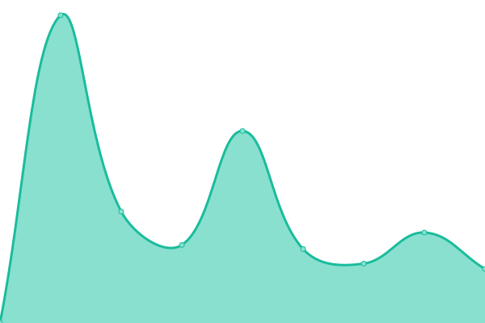

# [📈 Live Status](https://status.nuuk.fr): <!--live status--> **🟧 Partial outage**

This repository contains the open-source uptime monitor and status page for [Studio Nuük](nuuk.fr), powered by [Upptime](https://github.com/upptime/upptime).

With [Upptime](https://upptime.js.org), you can get your own unlimited and free uptime monitor and status page, powered entirely by a GitHub repository. We use [Issues](https://github.com/studionuuk/nuuktime/issues) as incident reports, [Actions](https://github.com/studionuuk/nuuktime/actions) as uptime monitors, and [Pages](https://status.nuuk.fr) for the status page.

<!--start: status pages-->
<!-- This summary is generated by Upptime (https://github.com/upptime/upptime) -->
<!-- Do not edit this manually, your changes will be overwritten -->
<!-- prettier-ignore -->
| URL | Status | History | Response Time | Uptime |
| --- | ------ | ------- | ------------- | ------ |
|  [Sols Vivants](https://www.solsvivants.org/) | 🟩 Up | [sols-vivants.yml](https://github.com/studionuuk/nuuktime/commits/HEAD/history/sols-vivants.yml) | 

 750ms
     
 | 

<a href="https://status.nuuk.fr/history/sols-vivants">100.00%</a>
    

|  [LinkUp Factory](https://linkupfactory.com/) | 🟩 Up | [link-up-factory.yml](https://github.com/studionuuk/nuuktime/commits/HEAD/history/link-up-factory.yml) | 

 557ms
     
 | 

<a href="https://status.nuuk.fr/history/link-up-factory">100.00%</a>
    

|  [Tennis Majors](https://www.tennismajors.com/) | 🟥 Down | [tennis-majors.yml](https://github.com/studionuuk/nuuktime/commits/HEAD/history/tennis-majors.yml) | 

 248ms
     
 | 

<a href="https://status.nuuk.fr/history/tennis-majors">100.00%</a>
    

|  [MagicRPM](https://www.magicrpm.com/) | 🟩 Up | [magic-rpm.yml](https://github.com/studionuuk/nuuktime/commits/HEAD/history/magic-rpm.yml) | 

 127ms
     
 | 

<a href="https://status.nuuk.fr/history/magic-rpm">100.00%</a>
    

|  [Serieously](https://www.serieously.com/) | 🟩 Up | [serieously.yml](https://github.com/studionuuk/nuuktime/commits/HEAD/history/serieously.yml) | 

 594ms
     
 | 

<a href="https://status.nuuk.fr/history/serieously">100.00%</a>
    

|  [Delpierre](https://www.delpierre.com/) | 🟩 Up | [delpierre.yml](https://github.com/studionuuk/nuuktime/commits/HEAD/history/delpierre.yml) | 

 816ms
     
 | 

<a href="https://status.nuuk.fr/history/delpierre">100.00%</a>
    

|  [Labeyrie](https://www.labeyrie.com/) | 🟩 Up | [labeyrie.yml](https://github.com/studionuuk/nuuktime/commits/HEAD/history/labeyrie.yml) | 

 899ms
     
 | 

<a href="https://status.nuuk.fr/history/labeyrie">100.00%</a>
    

|  [Viebois](https://viebois-champdieu.fr/) | 🟩 Up | [viebois.yml](https://github.com/studionuuk/nuuktime/commits/HEAD/history/viebois.yml) | 

 1780ms
     
 | 

<a href="https://status.nuuk.fr/history/viebois">99.84%</a>
    

|  [Scrine Production](https://scrineprod.fr/) | 🟩 Up | [scrine-production.yml](https://github.com/studionuuk/nuuktime/commits/HEAD/history/scrine-production.yml) | 

 238ms
     
 | 

<a href="https://status.nuuk.fr/history/scrine-production">100.00%</a>
    

|  [Thierry Aldeguer](https://aldeguer-thierry-avocat.fr/) | 🟩 Up | [thierry-aldeguer.yml](https://github.com/studionuuk/nuuktime/commits/HEAD/history/thierry-aldeguer.yml) | 

 840ms
     
 | 

<a href="https://status.nuuk.fr/history/thierry-aldeguer">100.00%</a>
    

|  [Studio Nuük](https://nuuk.fr/) | 🟩 Up | [studio-nuuek.yml](https://github.com/studionuuk/nuuktime/commits/HEAD/history/studio-nuuek.yml) | 

 616ms
     
 | 

<a href="https://status.nuuk.fr/history/studio-nuuek">100.00%</a>
    

|  [Uxo](https://with-uxo.com) | 🟩 Up | [uxo.yml](https://github.com/studionuuk/nuuktime/commits/HEAD/history/uxo.yml) | 

 273ms
     
 | 

<a href="https://status.nuuk.fr/history/uxo">100.00%</a>
    

<!--end: status pages-->

[**Visit our status website →**](https://status.nuuk.fr)

## 📄 License

- Powered by: [Upptime](https://github.com/upptime/upptime)
- Code: [MIT](./LICENSE) © [Studio Nuük](nuuk.fr)
- Data in the `./history` directory: [Open Database License](https://opendatacommons.org/licenses/odbl/1-0/)
